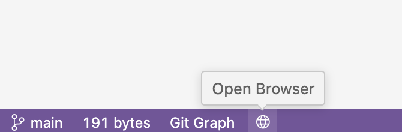

# open-in-repository-button

### vscode to add a button to open the repository in the browser

## Usage

vscode search for `open-in-repository-button`

- Theoretically support all git repositories

## enjoy it 🎉🎉🎉
